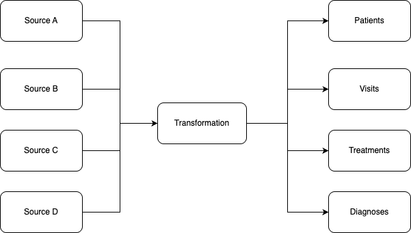

# healthcare-insights

The project includes a PostgreSQL database and Spark jobs. It aims to create an example of a healthcare data platform. All input data used in this project is mock/synthetic data created solely for demonstration purposes. To be able to run the project, you should have Docker installed.

## Setup

After installing Docker, run the following command:

```
docker-compose up -d --build
```

The first time, it may take some time because it needs to download dependencies such as PostgreSQL, some Python packages, etc.

When it is done, the environment is ready. It includes a solution for healthcare data coming from multiple sources with a large number of records daily.  
It is a scalable solution as well. The idea is that you should have 4 main tables and fit all sources into this and do it in parallel.

## Pipeline Steps

Our pipeline includes three steps:

- **Truncate partition**: Remove data if it exists for the given parameter to ensure fault tolerance.
- **Transform data**: This includes reading from the source and applying transformations based on it.
- **Write data**: Write into the correct table.

This pipeline is designed to run jobs in parallel. As long as dates or sources are different, you should be able to run it in parallel. The chart below also illustrates this.


## Manual Execution

### Create Tables

```
docker exec -it healthcare-insights-spark-1 spark-submit --jars /usr/share/java/postgresql.jar /app/run_sql_script.py patients.sql
docker exec -it healthcare-insights-spark-1 spark-submit --jars /usr/share/java/postgresql.jar /app/run_sql_script.py diagnoses.sql
docker exec -it healthcare-insights-spark-1 spark-submit --jars /usr/share/java/postgresql.jar /app/run_sql_script.py treatments.sql
docker exec -it healthcare-insights-spark-1 spark-submit --jars /usr/share/java/postgresql.jar /app/run_sql_script.py visits.sql
```

### Run Each Job

```
docker exec -it healthcare-insights-spark-1 spark-submit --jars /usr/share/java/postgresql.jar /app/visit_events_ingestion/main.py source_a 20230501
docker exec -it healthcare-insights-spark-1 spark-submit --jars /usr/share/java/postgresql.jar /app/visit_events_ingestion/main.py source_a 20230502
docker exec -it healthcare-insights-spark-1 spark-submit --jars /usr/share/java/postgresql.jar /app/visit_events_ingestion/main.py source_b 20230501
docker exec -it healthcare-insights-spark-1 spark-submit --jars /usr/share/java/postgresql.jar /app/visit_events_ingestion/main.py source_b 20230502
```

### Create View

```
docker exec -it healthcare-insights-spark-1 spark-submit --jars /usr/share/java/postgresql.jar /app/run_sql_script.py views/medicine_per_patient.sql
```

### Connect to Database

```
docker exec -it healthcare-insights-postgres-1 psql -U user -d demo
```

## Answers for Questions

### 1. Data Transformation & Loading

- Flatten and transform: Implemented  
- Load the transformed data into PostgreSQL: Implemented  
- Design the schema: Implemented

### 2. BI Accessibility

- Create SQL views or materialized views: Created  
- Ensure the data is accessible and usable:  
  Example query:
  ```
  SELECT * FROM patient_treatment_summary WHERE treatments_drug = 'Metformin';
  ```

### 3. Data Quality & Validation

- Implement data quality checks: One example implemented (`remove_bad_quality_data` function)  
- Document how to handle data from multiple sources:  
  A small framework with an abstract base class is used. Each source can have its own transformation logic, but uses the same writing process. Jobs can run in parallel.

### 4. Security & Compliance

- Describe your approach to securing sensitive data:  
  Ideally, we avoid storing sensitive data. It should be masked before reaching the system. If not, we mask it on first touch and restrict access to raw dumps.

- Ensure compliance with healthcare data regulations:  
  I would recommend framework-based approach to handle data appropriately at ingestion time. We can have something generic for the data-platform so can be usable multiple times.

### 5. Scalability & Performance

- How the solution scales to millions of records:  
  PySpark is used with partitioned and indexed tables. Scaling the cluster improves performance. Advanced optimizations (e.g., repartitioning) are possible if large volumes exist.

- Indexing, partitioning, and optimization:  
  Tables use partitions and subpartitions. Filters make queries efficient. Some fields have indexes (see table creation scripts). Structure is optimized for large data; unnecessary for small volumes.

## Summary

This implementation supports large-scale parallel processing, fault tolerance, and extensibility across multiple data sources.

Advantages:
- Parallel execution support
- Scalable architecture
- Reusable transformation framework

Limitations:
- Not optimized for real-time streaming at high volumes
- Possibly over-engineered for small datasets
- Schema design may need adjustments based on query patterns
